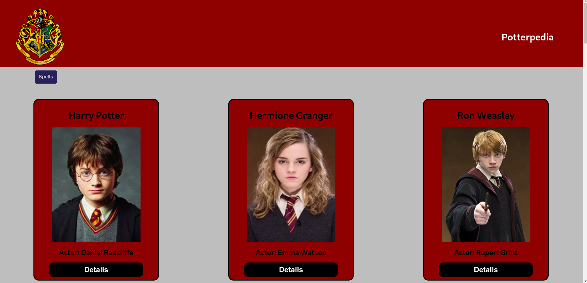

# Projeto Potter 

Este projeto utiliza a HP-API para criar uma lista com alguns personagens do Harry Potter com algumas de suas informações, como a Casa a qual fez parte em Hogwarts, data de nascimento e o intérprete nos filmes.

Projeto em andamento.

### Tecnologias utilizadas
1. React.js
2. JavaScript
3. Styled-components

### Como rodar este projeto

É importante ter o [Node](https://nodejs.org/en) instalado.
1. Faça um fork deste repositório:
```bash
git clone https://github.com/carolcampos22/projeto-potter.git
```

2. Entre na pasta do projeto:
```bash
cd projeto-potter
```

3. Instale as dependencias:
```bash
npm install
```

4. Inicie o projeto:
```bash
npm run start
```
O projeto abrirá na porta localhost:3000.

### Layout

1. Página dos personagens:


2. Página dos feitiços:


### Próximos passos
- Homepage
- Página de detalhes dos personagens
- Estilizações
- Futuramente, este projeto será refatorado para ser utilizado Next.js.

### Autora

#### Carolina Mendes - Web Developer
[](https://www.linkedin.com/in/dev-carolina-mendes/)